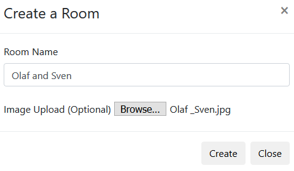

## An interactive online canvas for doodling on the internet
This is the product of a group project for University of Calgary's SENG513 Web Based Systems, in Spring 2018.
This online canvas recreates the experience of doodling.
Main advantages of an online canvas are 1) users could collaborate remotely and 2) users are not limited by physical restrictions on a paper, meaning no shoving elbows, looking at canvas up side down.
The requirement of this project is to create a Javascript web application with server and client sides. Additionally, it must support up to 5 concurrent users and feature data persistence. 
This project is currently hosted on domain [www.edoodle.ca](http://www.edoodle.ca) for demo purposes.

##### Expected outcome
<p align="center">
  
</p>

##### Actual outcome
<p align="center">
  
</p>

### Features
* Supports multiple concurrent users drawing on the same canvas.
<p align="center">
  
</p>
* Allows creation of a new canvas with user selection of background image, like a coloring page.
* Enables a user to download a copy of current canvas
* Simulcast activity on multiple canvas


### Getting started
Running the source code of this project requires a current installation of NPM.
To start this project locally, run: 
```
npm install
npm start
```
Or visit www.edoodle.ca

### Theory, method and results

### Future work
Further work could provide:
1. Chat room funcitonality between users on the same canvas.
2. Database for saving canvas state.
3. Provide user login, giving user option for keeping a canvas private or shared for authorized users.